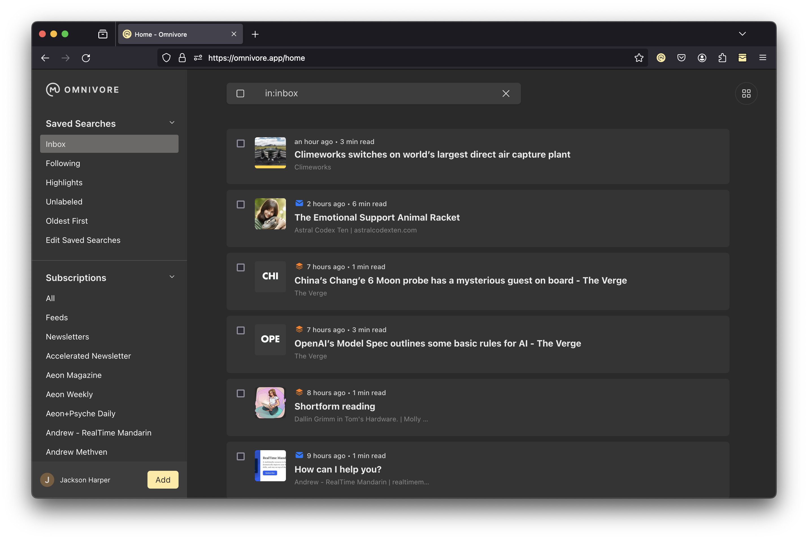

# {{ $frontmatter.title }}

Hey, welcome to Omnivore. Omnivore was built to help you get more insights and enjoyment from your daily reading. This quick guide will get you started on that journey.

## The Reader

There are two main views in Omnivore: the reader and the library. Right now you are in the reader view. The reader strips distractions out of web pages and formats things nicely so you can enjoy what's important: the content.

In the reader you can select text and add highlights (try it out!). You can also create notes, and add notes to your highlights. If you are an iOS user you can listen to your articles using text to speech.

When you are done reading an article you can delete it or archive it using the buttons on the lefthand side of the reader (or at the top on mobile). Archived items are saved forever, so you still have the content even if the site goes away.

## The Library

The other important view in Omnivore is the library. This is where all your saved items will appear. You can organize your library by creating labels and saved searches.

When you are starting out with Omnivore it is important to learn how to save items.

The easiest way is the add button at the bottom of the menu on the left side of the library. Clicking this will open the add dialog where you can save links, upload PDFs, subscribe to feeds, or import items from a legacy reader app.

Besides the Add button, you can also use the mobile apps and browser extensions to save items.

You can organize things in the library by creating labels and saved searches.

## Subscriptions

Many users enjoy reading their subscriptions in Omnivore. In fact, we find the most productive users usually have a few (but not too many) subscriptions. With Omnivore you can create an email address and use it to subscribe to newsletters or you can add rss and atom feeds.

## Native Apps and Browser Extensions

Omnivore has browser extensions and mobile apps to make saving and reading easier.

Our native iOS and Android apps sync your reading to the device so it’s available offline. They also make it easier to save items by providing share extensions, and on iOS allow you to listen to your articles with text-to-speech.

You can install the native iOS app [here](https://omnivore.app/install/ios) and the native Android (prelease) app [here](https://omnivore.app/install/android).

Browser extensions can save the URLs and the content of the page you are viewing. They also allow creating notes and adding labels while saving. We have browser extensions available for [Firefox](https://omnivore.app/firefox), [Chrome](https://omnivore.app/chrome), [Edge](https://omnivore.app/install/edge), and [Safari](https://omnivore.app/install/safari).

## Get Started

Our goal is to help people gain more insights and enjoyment from their daily reading. If there’s something we could do to improve that, please use the feedback button from the menu.

Now, archive this article and go enjoy some reading!
